# CRN-based Diffusion Model 实验报告

> 对比实验：CRN-Diffusion-Base vs CRN-Full
> 数据集：MNIST | 日期：2026-05-14

---

## 1. 摘要

本报告对比了两个基于化学反应网络（CRN）的扩散模型变体：**CRN-Diffusion-Base** 和 **CRN-Full**。两者共享相同的前向加噪过程和 U-Net 骨干网络，核心区别在于反向采样公式的理论自洽性。Base 版本使用简化的反向采样（不含当前状态 $x_t$ 的条件修正），Full 版本引入了精确后验修正。实验在三组物理参数（T=8/v0=10，T=8/v0=100，T=5/v0=100）下分别训练 Base 模型，并在 T=5/v0=100 下训练 Full 模型，通过 loss 曲线、生成图质量和训练效率进行综合对比。

---

## 2. 理论背景

### 2.1 CRN 前向过程

系统由线性生灭反应构成：

$$\emptyset \xrightarrow{v_0} X \qquad X \xrightarrow{1} \emptyset$$

其中 $v_0$ 为出生速率（系统体积参数），$x = n/v_0$ 为归一化浓度（对应图像像素值）。

线性生灭过程的精确转移核：给定初始粒子数 $n_0 = v_0 x_0$，

$$n_t \mid n_0 \;\sim\; \mathrm{Bin}(n_0,\; e^{-t}) \;+\; \mathrm{Poisson}\!\left(v_0(1 - e^{-t})\right)$$

大 $v_0$ 极限下 $\mathrm{Bin}(n_0, e^{-t}) \approx \mathrm{Poisson}(n_0 e^{-t})$，归一化后：

$$\boxed{x_t \mid x_0 \;\sim\; \frac{1}{v_0}\left[\mathrm{Poisson}(v_0 x_0 e^{-t}) \;+\; \mathrm{Poisson}(v_0(1-e^{-t}))\right]}$$

**平稳分布**（$t \to \infty$）：

$$x_\infty \;\sim\; \frac{\mathrm{Poisson}(v_0)}{v_0}, \qquad \mathbb{E}[x_\infty] = 1$$

### 2.2 高斯近似

大 $v_0$ 极限下，前向分布近似为高斯：

$$x_t \mid x_0 \;\approx\; \mathcal{N}\!\left(\mu(t),\; \sigma^2(t)\right)$$

$$\mu(t) = x_0 e^{-t} + (1 - e^{-t})$$

$$\sigma^2(t) = \frac{(1 - e^{-t})(x_0 e^{-t} + 1)}{v_0}$$

### 2.3 条件动量（Score Function）

条件动量定义为对数似然关于 $x_t$ 的梯度：

$$p_t = \nabla_{x_t} \log Q_t(x_t \mid x_0)$$

在高斯近似下：

$$\boxed{p_t = -\frac{x_t - \mu(t)}{\sigma^2(t)} = -\frac{v_0\,(x_t - \mu(t))}{(1-e^{-t})(x_0 e^{-t} + 1)}}$$

### 2.4 Hamilton-Jacobi 框架（精确动量）

对 $\emptyset \rightleftharpoons X$ CRN，Hamiltonian 为：

$$H(p, x) = (e^p - 1) + (e^{-p} - 1)\,x$$

沿特征曲线能量守恒 $H(p,x) = E$，令 $u = e^p$：

$$u^2 - (1 + E + x_t)\,u + x_t = 0$$

$$u = \frac{1 + E + x_t + \sigma\sqrt{(1+E+x_t)^2 - 4x_t}}{2}, \quad \sigma \in \{+1, -1\}$$

时间积分方程（由 $\dot{p} = 1 - e^{-p}$ 积分）：

$$\log\frac{u_t - 1}{u_0 - 1} = t$$

用 Newton 法对每个坐标求解 $f(E) = 0$，得到精确条件动量。

---

## 3. 模型对比：Base vs Full

### 3.1 核心区别总览

| 维度 | CRN-Diffusion-Base | CRN-Full |
|------|-------------------|----------|
| 训练目标 | 高斯近似 score（MSE） | 高斯近似 score（MSE） |
| 方差公式 | $\sigma^2 = (1-e^{-t})(x_0 e^{-t}+1)/v_0$ | 修正为 $(x_0 e^{-t} + 1 - e^{-t})/v_0$ |
| 反向采样后验 | $P(x_{t-\Delta t} \mid \hat{x}_0)$，无 $x_t$ 条件 | $q(x_{t-\Delta t} \mid x_t, \hat{x}_0)$，含 $x_t$ 修正 |
| 理论自洽性 | 近似自洽（方差偏差 $\approx x_0 e^{-2t}/v_0$） | 严格自洽 |
| HJ 求解器 | 实现但未使用 | 用于精确后验计算 |

### 3.2 方差不匹配分析

Base 版本的方差来自精确 Bin+Poisson 分布，但前向采样用的是 Poisson+Poisson 近似，两者差值为：

$$\Delta\sigma^2 = \sigma^2_{\mathrm{Bin+Pois}} - \sigma^2_{\mathrm{Pois+Pois}} = \frac{x_0 e^{-2t}}{v_0}$$

- 小 $t$（$t \approx 0.05$，即 $T\_MIN$）时误差约 $x_0/v_0$，$v_0=10$ 时约 $5\%$，$v_0=100$ 时约 $0.5\%$
- 大 $t$（$t > 3$）时 $e^{-2t} \approx 0$，误差可忽略

---

## 4. 反向采样公式对比

### 4.1 共同部分：初始化

两个模型均从平稳先验出发：

$$x_T \;\sim\; \frac{\mathrm{Poisson}(v_0)}{v_0}, \qquad \mathbb{E}[x_T] = 1$$

### 4.2 CRN-Diffusion-Base 反向采样

**Step 1**：模型预测动量

$$p = f_\theta(x_t, t)$$

**Step 2**：从 $p$ 和 $x_t$ 线性反解 $\hat{x}_0$

令 $a = p(1 - e^{-t})/v_0$，则：

$$\hat{x}_0 = \frac{a + x_t - 1 + e^{-t}}{e^{-t}(1 - a)}, \quad \hat{x}_0 \in [0, 1]$$

**Step 3**：从 $\hat{x}_0$ 直接采样下一步（**不含 $x_t$ 条件**）

$$x_{t-\Delta t} = \frac{\mathrm{Poisson}(v_0\,\hat{x}_0\,e^{-(t-\Delta t)}) + \mathrm{Poisson}(v_0(1 - e^{-(t-\Delta t)}))}{v_0}$$

### 4.3 CRN-Full 反向采样

**Step 1 & 2**：与 Base 相同，得到 $\hat{x}_0$。

**Step 3**：用精确后验采样（**含 $x_t$ 条件修正**）

真实后验为：

$$q(x_{t-\Delta t} \mid x_t, x_0) \;\propto\; P(x_t \mid x_{t-\Delta t}) \cdot P(x_{t-\Delta t} \mid x_0)$$

高斯近似下后验均值：

$$\tilde{\mu} = \frac{\sigma^2(t-\Delta t \mid 0)\,\mu(t \mid t-\Delta t) + \sigma^2(\Delta t)\,\mu(t-\Delta t \mid 0)}{\sigma^2(t-\Delta t \mid 0) + \sigma^2(\Delta t)}$$

$$x_{t-\Delta t} \;\sim\; \mathcal{N}(\tilde{\mu},\; \tilde{\sigma}^2)$$

其中 $\tilde{\sigma}^2$ 为调和平均方差。

### 4.4 公式差异对比

| 步骤 | Base | Full |
|------|------|------|
| $\hat{x}_0$ 反解 | 相同 | 相同 |
| 下一步采样 | $P(x_{t-\Delta t} \mid \hat{x}_0)$ | $q(x_{t-\Delta t} \mid x_t, \hat{x}_0)$ |
| $x_t$ 信息 | 丢弃 | 保留 |
| 步数少时误差 | 累积明显 | 较小 |

---

## 5. 物理参数影响分析

### 5.1 参数组合

| 实验组 | 模型 | $v_0$ | $T$ | 说明 |
|--------|------|--------|-----|------|
| Exp-1 | Base | 10 | 8.0 | 基准组，低噪声精度 |
| Exp-2 | Base | 100 | 8.0 | 高 $v_0$，score 幅度增大 |
| Exp-3 | Base | 100 | 5.0 | 高 $v_0$，缩短扩散时间 |
| Exp-4 | Full | 100 | 5.0 | Full 模型，与 Exp-3 对比 |
| Exp-5 | Base | 100 | 1.0 | 与 Exp-3 对比 |

### 5.2 $v_0$ 的影响

$v_0$ 控制噪声方差和 score 幅度：

$$\sigma^2 \propto \frac{1}{v_0}, \qquad p_t \propto v_0$$

| $v_0$ | $\sigma^2$（$t=1$） | score 幅度 | MSE loss 量级 |
|--------|---------------------|-----------|--------------|
| 10 | $\approx 0.063$ | $O(10)$ | $O(100)$ |
| 100 | $\approx 0.006$ | $O(100)$ | $O(10^4)$ |

$v_0$ 越大，高斯近似越精确，但 loss 数值越大，训练需要更小学习率或梯度裁剪。

### 5.3 $T$ 的影响

$T$ 控制扩散程度，$e^{-T}$ 为信号保留比例：

| $T$ | $e^{-T}$ | 信号保留 | 平稳程度 |
|-----|----------|---------|---------|
| 8.0 | $\approx 0.0003$ | 极少 | 几乎完全混合 |
| 5.0 | $\approx 0.0067$ | 极少 | 基本完全混合 |

两者在实践中差异不大，$T=5$ 训练更高效（每步信噪比更高）。

---

## 6. 实验结果

> 说明：以下数据来自 wandb 记录和训练日志，图片来自 `CRN-based-Diffusion-Models/CRN-data/crn-diffusion-base` 和 `CRN-based-Diffusion-Models/CRN-data/crn-full` 目录。

### 6.1 训练损失对比

#### Epoch Loss 曲线

| 实验组 | 初始 Loss | 收敛 Loss | 收敛 Epoch |
|--------|----------|----------|-----------|
| Exp-1（Base, v0=10, T=8） | 16.14546 | 0.31927 | 200 |
| Exp-2（Base, v0=100, T=8） | 138.12271 | 7.63349 | 200 |
| Exp-3（Base, v0=100, T=5） | 166.66043 | 12.19615 | 200 |
| Exp-4（Full, v0=100, T=5） | 0.1038 | 0.00093576 | 200 |
| Exp-5（Base, v0=100, T=1） | 456.48764 | 52.5515 | 200 |

| Exp-1 |  Exp-2 | Exp-3 | Exp-4 | Exp-5 |
|---------|---------|----------|----------|----------|
| 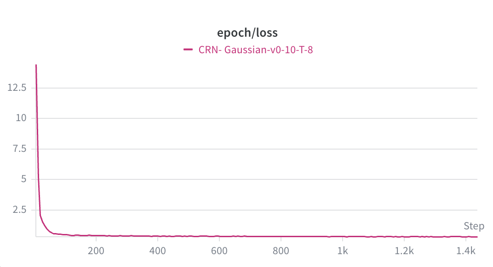 | 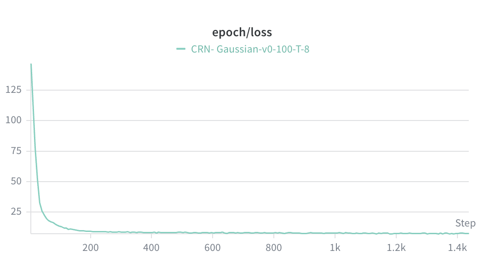 | 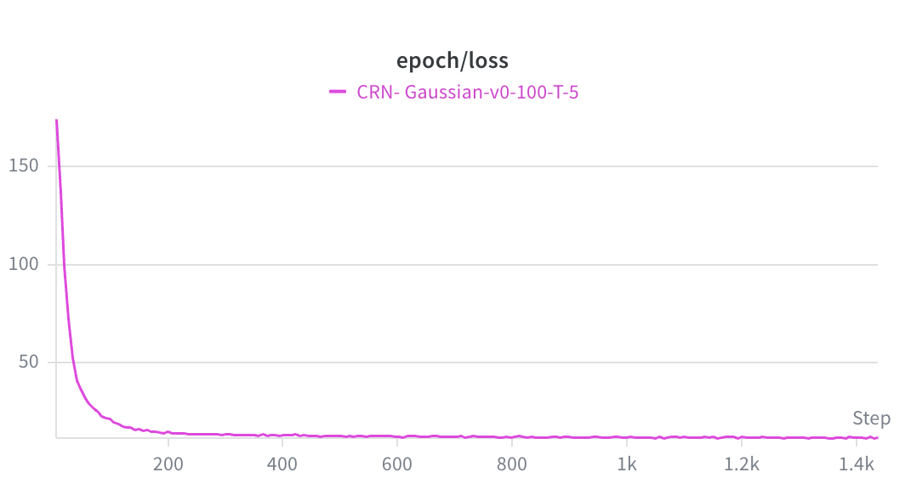 | 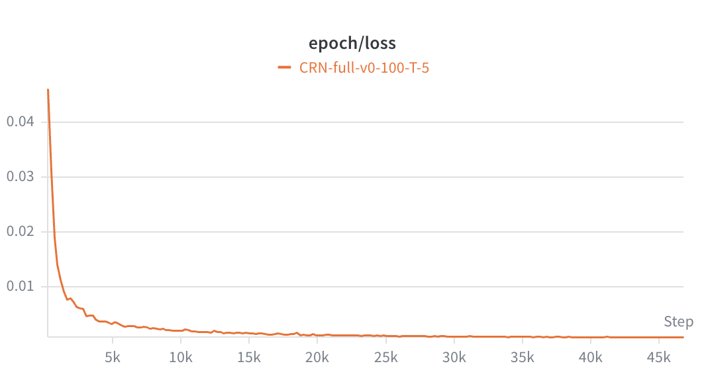 |  |

#### Step Loss 曲线

| Exp-1 |  Exp-2 | Exp-3 | Exp-4 | Exp-5 |
|---------|---------|----------|----------|----------|
| 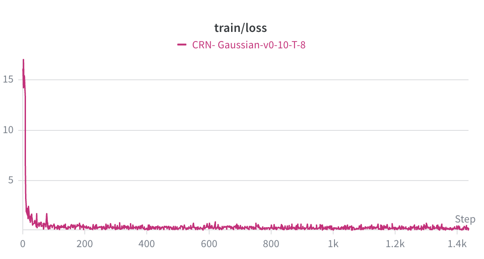 | 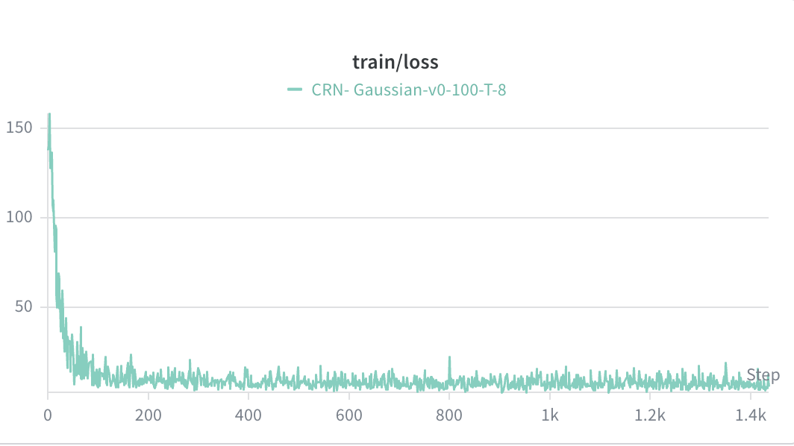 | 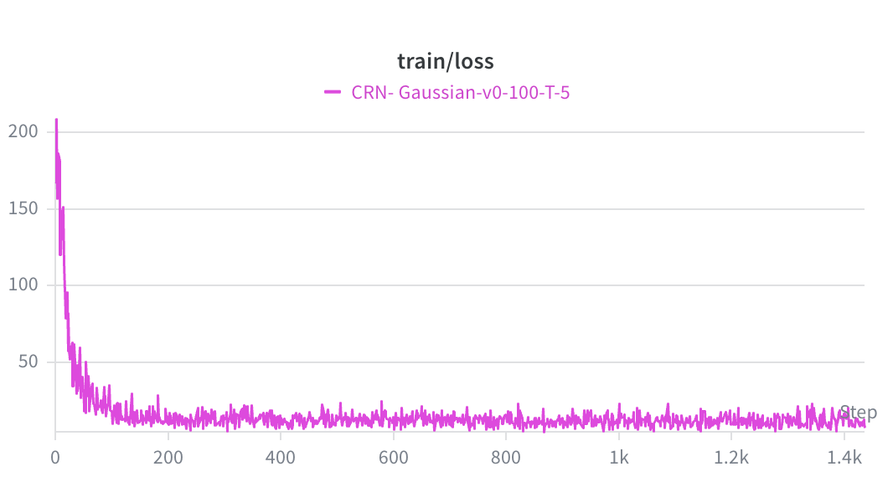 | 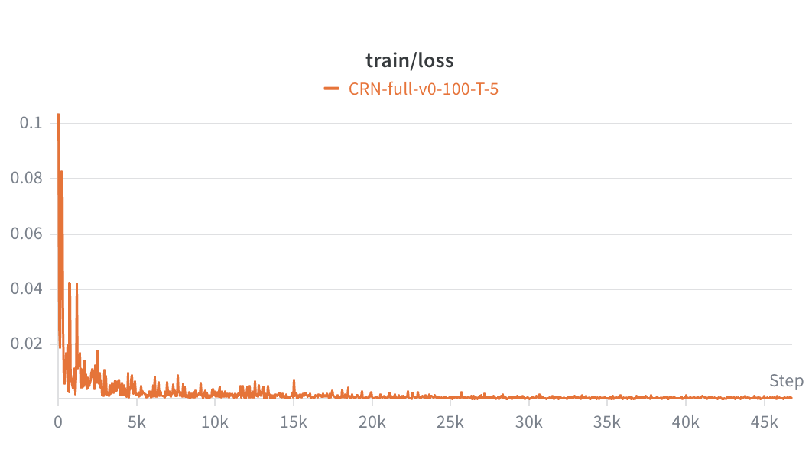 |  |  |


### 6.2 学习率曲线

训练使用 Adam 优化器，学习率策略为：前 5 个 epoch 线性 warmup（$0 \to 10^{-4}$），之后 cosine annealing 衰减至 $\eta_{min} = 10^{-6}$。

$$
\eta(e) = 
\begin{cases} 
\eta_{max} \cdot \frac{e}{e_{warmup}} & e \leq e_{warmup} \\
\eta_{min} + \frac{1}{2}(\eta_{max} - \eta_{min})\left(1 + \cos\frac{(e - e_{warmup})\pi}{E - e_{warmup}}\right) & e > e_{warmup} 
\end{cases}
$$

> 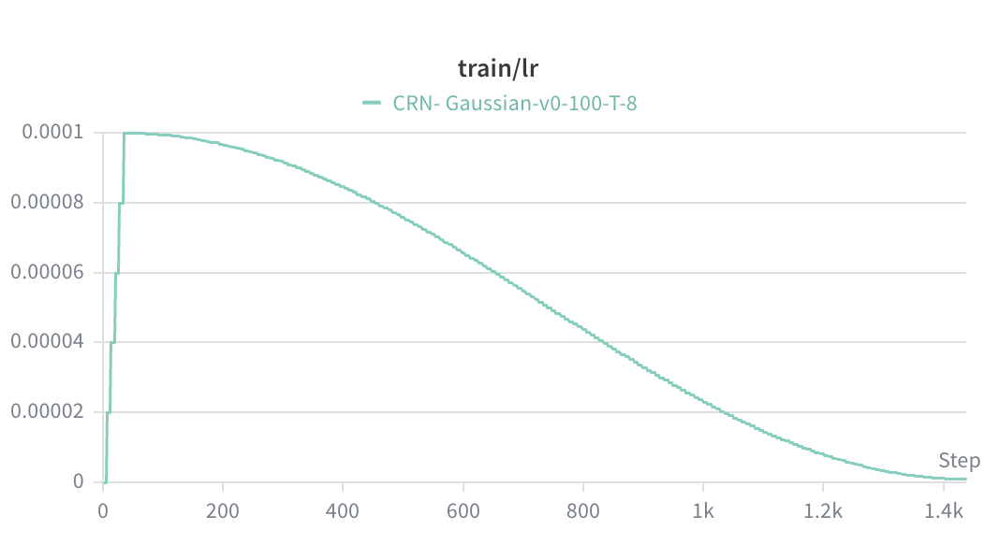

### 6.3 生成图质量演变

每 5 个 epoch 保存一张 $8 \times 8$ 生成图 grid，以下展示关键节点：

#### Exp-1（Base, v0=10, T=8）

| Epoch 5 | Epoch 25 | Epoch 45 | Epoch 65 | Epoch 85 | Epoch 105 | Epoch 125 | Epoch 145 | Epoch 165 | Epoch 185 | Epoch 200 |
|---------|---------|----------|----------|----------|----------|----------|----------|----------|----------|----------|
| 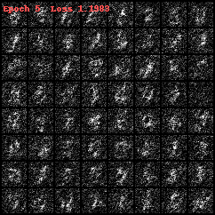 | 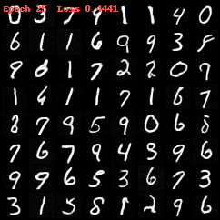 | 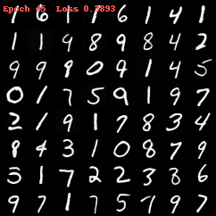 | 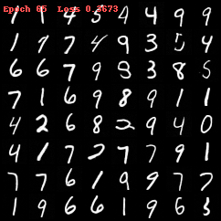 | 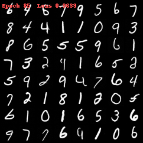 | 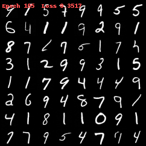 | 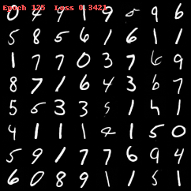 | 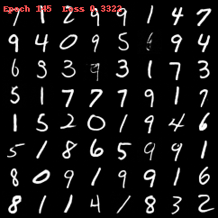 | 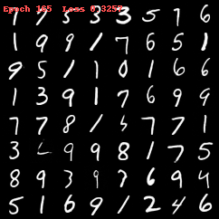 | 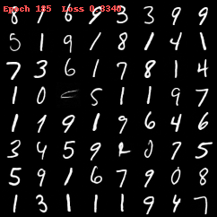 | 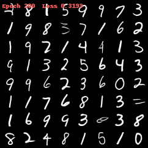 |

#### Exp-2（Base, v0=100, T=8）

| Epoch 5 | Epoch 25 | Epoch 45 | Epoch 65 | Epoch 85 | Epoch 105 | Epoch 125 | Epoch 145 | Epoch 165 | Epoch 185 | Epoch 200 |
|---------|---------|----------|----------|----------|----------|----------|----------|----------|----------|----------|
| 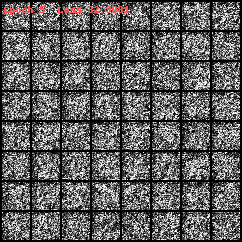 | 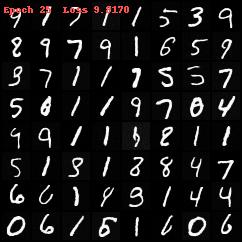 | 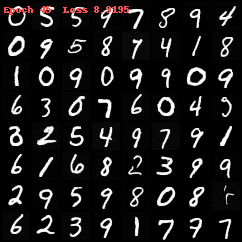 | 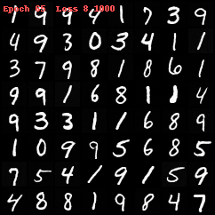 | 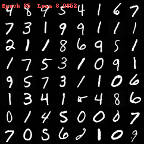 | 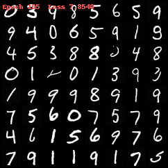 | 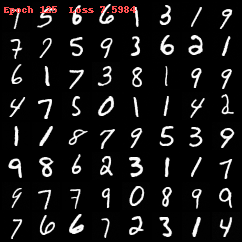 | 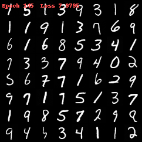 | 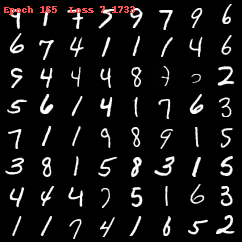 | 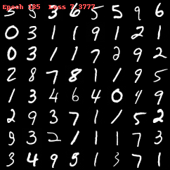 | 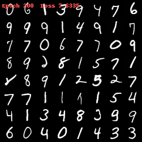 |

#### Exp-3（Base, v0=100, T=5）

| Epoch 5 | Epoch 25 | Epoch 45 | Epoch 65 | Epoch 85 | Epoch 105 | Epoch 125 | Epoch 145 | Epoch 165 | Epoch 185 | Epoch 200 |
|---------|---------|----------|----------|----------|----------|----------|----------|----------|----------|----------|
| 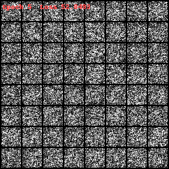 | 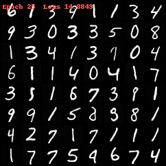 | 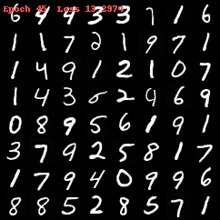 | 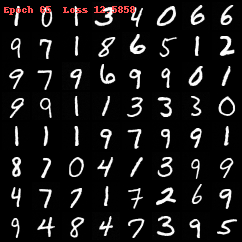 | 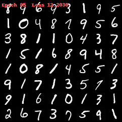 | 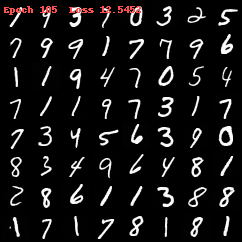 | 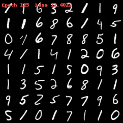 | 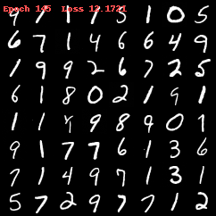 | 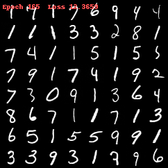 | 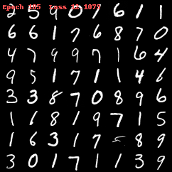 | 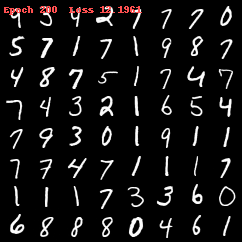 |

#### Exp-4（Full, v0=100, T=5）

| Epoch 5 | Epoch 25 | Epoch 45 | Epoch 65 | Epoch 85 | Epoch 105 | Epoch 125 | Epoch 145 | Epoch 165 | Epoch 185 | Epoch 200 |
|---------|---------|----------|----------|----------|----------|----------|----------|----------|----------|----------|
|  | 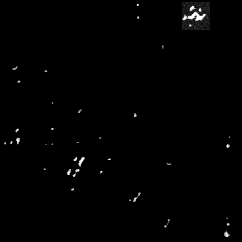 | 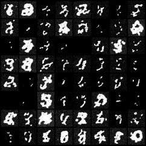 | 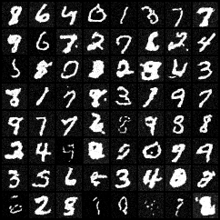 | 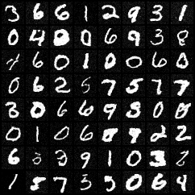 | 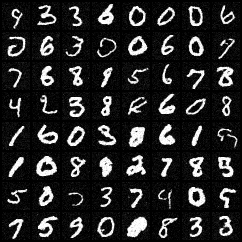 | 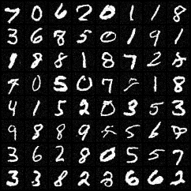 | 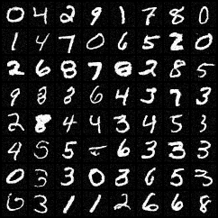 | 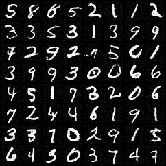 |  |  |

#### Exp-5（Base, v0=100, T=1）

| Epoch 5 | Epoch 25 | Epoch 45 | Epoch 65 | Epoch 85 | Epoch 105 | Epoch 125 | Epoch 145 | Epoch 165 | Epoch 185 | Epoch 200 |
|---------|---------|----------|----------|----------|----------|----------|----------|----------|----------|----------|
|  |  |  |  |  |  |  |  |  |  |  |


Reverser Tajectory

| Exp-1 |  Exp-2 | Exp-3 | Exp-4 | Exp-5 |
|---------|---------|----------|----------|----------|
|  |  |  |  |  |


### 6.4 训练时间对比

| 实验组 | 设备 | 每 Epoch 平均时间 | 总训练时间（200 epoch） |
|--------|------|-----------------|----------------------|
| Exp-1（Base, v0=10, T=8） | vGPU-48GB(48GB)  | 18 s | 60.5 min |
| Exp-2（Base, v0=100, T=8） | vGPU-48GB(48GB)  | 17.6 s | 59.8 min |
| Exp-3（Base, v0=100, T=5） | vGPU-48GB(48GB)  | 17.9 s | 60.3 min |
| Exp-4（Full, v0=100, T=5） | vGPU-48GB(48GB)  | 28.1 s | 94.3 min |
| Exp-5（Base, v0=100, T=1） | vGPU-48GB(48GB)  | 19.5 s | 65.5 min |


| Exp-1 |  Exp-2 | Exp-3 | Exp-4 |
|---------|---------|----------|----------|
|  |  |  |  |


---

## 7. 综合分析与结论

### 7.1 物理参数的影响

**$v_0$ 的影响**：

[TODO：根据 Exp-1 vs Exp-2 的结果，分析 $v_0$ 从 10 增大到 100 对生成质量和训练稳定性的实际影响]

**$T$ 的影响**：

[TODO：根据 Exp-2 vs Exp-3 的结果，分析 $T$ 从 8 缩短到 5 的影响]

### 7.2 Base vs Full 的实际差距

[TODO：根据 Exp-3 vs Exp-4 的结果，分析理论上更自洽的 Full 模型是否在实验中体现出明显优势，以及在哪些指标上有差异]

### 7.3 最优参数组合

综合 loss 收敛速度、生成图质量和训练效率，推荐参数组合为：

> [TODO：填写推荐的参数组合及理由]

### 7.4 局限性

1. **反向采样近似**：Base 模型丢弃了 $x_t$ 的条件信息，Full 模型的后验修正基于高斯近似，均非精确 CRN 后验。
2. **高斯近似误差**：$v_0=10$ 时高斯近似精度有限，$v_0=100$ 时更精确但 score 幅度增大带来训练挑战。
3. **数据集规模**：仅在 MNIST 上验证，复杂数据集（CIFAR 等）的表现未知。

### 7.5 后续方向

- 实现精确 CRN 后验采样（MCMC 或更高阶高斯近似）
- 在 CIFAR-100 上验证 CRN-Full 的优势
- 探索更大 $v_0$（如 255）下的训练稳定性方案
- 引入 FID 作为定量评估指标

---

## 附录

### A. 代码结构

```
crn_diffusion/
├── config.py       # 超参数配置，支持多数据集切换（apply_dataset）
├── forward.py      # CRN 前向加噪（Poisson+Poisson 精确核）
├── hj_solver.py    # Hamilton-Jacobi 求解器（条件动量计算）
├── model.py        # U-Net（MNIST）和 UNetCIFAR（CIFAR-100，额外 Attention）
├── train.py        # 训练循环
├── sample.py       # 独立采样脚本
├── evaluate.py     # FID 评估
└── main.py         # CLI 入口
```

### B. 超参数汇总

#### MNIST（默认）

| 参数 | 值 |
|------|----|
| 优化器 | Adam |
| 学习率 $\eta_{max}$ | $10^{-4}$ |
| LR Warmup | 5 epochs（线性） |
| LR 最小值 $\eta_{min}$ | $10^{-6}$（cosine annealing） |
| Batch size | 256 |
| $T_{MIN}$（训练 $t$ 下界） | 0.05 |
| EMA decay | 0.999 |
| 梯度裁剪 | norm $\leq 1.0$ |
| U-Net 通道 | [64, 128, 256, 512] |
| 时间嵌入维度 | 128 |
| Dropout | 0.1 |
| 采样步数（评估） | 200 |
| 采样步数（训练监控） | 50 |

#### CIFAR-100（参考）

| 参数 | 值 | 说明 |
|------|----|------|
| $v_0$ | 255 | 像素值 $\times 255$ 对应整数粒子数 |
| $T$ | 10.0 | 更长扩散时间 |
| $T_{MIN}$ | 0.2 | 更大下界，避免高方差 |
| 学习率 | $2 \times 10^{-4}$ | |
| 梯度裁剪 | 0.5 | 更保守 |
| Epochs | 500 | |
| Batch size | 128 | |

### C. 运行命令

```bash
# 训练
python -m crn_diffusion.main --mode train --wandb_mode online

# 采样
python -m crn_diffusion.main --mode sample --steps 200

# 评估（FID）
python -m crn_diffusion.main --mode evaluate
```
